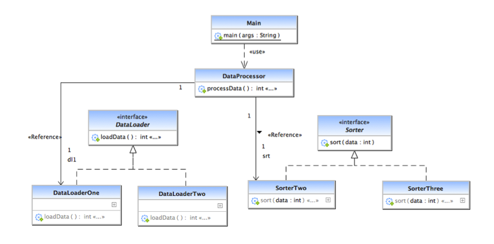

### Escuela Colombiana de Ingeniería
#### Arquitecturas de Software
#### Parcial - Tercio 1.


Para este ejercicio, clone este repositorio:

git clone https://gitlab.com/ARSW-ECI/2016-2-Par1T.git

Si lo descarga, se perderá el repositorio GIT de base, el cual es requerido para la entrega. Las respuestas a las preguntas abiertas deben escribirse en el archivo RESPUESTAS.txt, incluido en este repositorio.


## Parte 1

En la carpeta 'Parte1' se tiene una aplicación multi-hilo que busca paralelizar el procesamiento de un flujo de datos provisto por una fuente externa. En este caso, la fuente de datos es -esporádicamente- bastante lenta en la transmisión de los datos (puede pausarse incluso algunos segundos).

En general, la funcionalidad es la siguiente:

* El hilo DataSourceStream extrae contínuamente los datos provistos a través de la clase DataSource (importado como librería externa), y los encola en una cola concurrente.
* Cada hilo DataStreamProcesor consulta el siguiente elemento disponible en dicha cola, lo 'procesa' (por ahora simplemente muestra su valor por STDOUT), e incrementa un contador común (usado para mostrar, posteriormente, el número de datos procesados).

Al correr la aplicación, se puede observar que la misma usa de forma muy intensiva el procesador, dado que cuando no hay datos, realiza una ESPERA ACTIVA hasta que la cola tenga nuevamente elementos. Por otro lado, no se ha analizado si la misma presenta, en algún aspecto, condiciones de carrera que puedan llevar a comportamientos o resultados erróneos.
	
Teniendo en cuenta lo anterior:
	
1. Haga los ajustes necesarios para que la aplicación no use innecesariamente los recursos de CPU mientras la cola no tenga elementos. Esta solución debe igual garantizar que, en cuanto haya datos disponibles, éstos empiecen a ser procesados inmediatamente.
2. En el archivo de respuestas indique: hay condiciones de carrera en lo planteado?. En qué clase y en qué líneas de código está la región crítica?.
3. Haga los ajustes necesarios para que ya no se den las condiciones de carrera.

## Parte 2

El siguiente es el modelo de clases de la herramienta de procesamiento de datos (cuyos fuentes están en la carpeta 'Parte2'), que depende principalmente de un componente llamado DataProcessor. Esta herramienta básicamente (a través del DataProcessor) carga datos mediante un DataLoader, y luego los ordena a través de un Sorter. Como se observa, por ahora hay dos mecanismos diferentes para cargar datos y dos mecanismos diferentes para ordenarlos. Igualmente, se puede observar que este modelo no cumple con el principio DiP (Dependency Inversion Principle).




1. Ajuste el código entregado para que el programa cumpla con el principio Abierto/Cerrado, en cuanto a que se le puedan cambiar las estrategias de carga y ordenamiento SIN modificar el código central. En este caso, se espera que dicha configuración se pueda realizar desde un archivo de configuración de Spring.

2. Al código existente agregue un aspecto que, de forma no invasiva, mida el tiempo de ejecución del cargador de datos y del componente de ordenamiento que se hayan inyectado en el momento de la ejecución. 

	Una vez el aspecto tenga los datos, éste debe imprimir por pantalla:

	Nombre del componente de carga: _____ Tiempo: _____ ms
	Nombre del componente de ordenamiento: ____ Tiempo: _____ ms
	
	Donde 'nombre' el lo obtenido con el método 'getNombre' de dichos componentes.
	
	(Nota: La lógica de (o los) aspecto(s) desarrollados deben quedar en la clase edu.eci.arsw.par1t.aspects.AspectsHandler)


3. De acuerdo con lo hecho en el punto 2, describa en la hoja de respuestas los siguientes elementos del aspecto desarrollado:

   * Pointcut:	
	* Advice:
	* Número de posibles joinpoints:

## Entrega

Siga al pie de la letra estas indicaciones para la entrega del examen.

1. Configure su usuario de GIT

	```bash
$ git config --global user.name "Juan Perez"
$ git config --global user.email juan.perez@escuelaing.edu.co
```

2. Desde el directorio raíz (donde está este archivo README.md), haga commit de lo realizado.

	```bash
$ git add .
$ git commit -m "entrega proyecto - Juan Perez"
```

3. Desde este mismo directorio, comprima todo con:

	```bash
$ zip * -r APELLIDO.NOMBRE.zip .
```

4. Suba el archivo antes creado (APELLIDO.NOMBRE.zip) en el espacio de moodle correspondiente.
5. IMPORTANTE!. Conserve una copia de la carpeta y del archivo .ZIP.